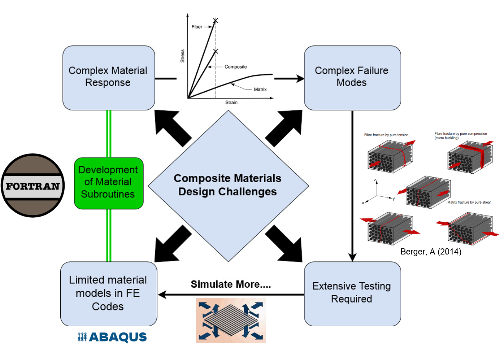
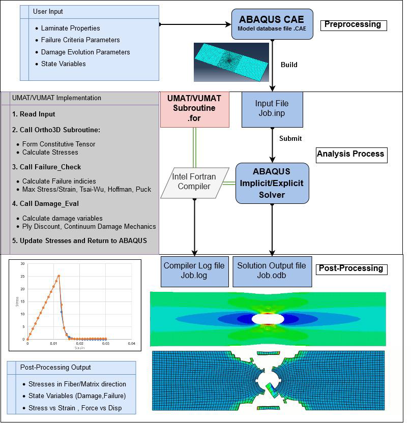

# Development of the Failure Criteria for Composites 

- [Development of the Failure Criteria for Composites](#development-of-the-failure-criteria-for-composites)
  - [Introduction](#introduction)
  - [Implementation](#implementation)

We deal with progressive stuff

## Introduction




More text here

- Number 1 item
- Partz
- Alcohol
  
Then we have numbered list

1. Dharmin
2. Ammar
3. Hamza

Here is a link to [google](https://www.google.com)

This is **bold**

This is _italic_

This is underline

## Implementation

Here is an image




Easy stuff

```fortran
PROGRAM Triangle
    IMPLICIT NONE
    REAL :: a, b, c, Area
    PRINT *, 'Welcome, please enter the&
            &lengths of the 3 sides.'
    READ *, a, b, c
    PRINT *, 'Triangle''s area:  ', Area(a,b,c)
END PROGRAM Triangle
```

This is inline code `Bye world!`

|**Value**|**Tag**|**Converted Color**|
|---|---|---|
| 0|Unlabeled|( 0, 0, 0)|
| 1|Building|( 70, 70, 70)|
| 2|Fence|(190, 153, 153)|
| 3|Other|(250, 170, 160)|
| 4|Pedestrian|(220, 20, 60)|
| 5|Pole|(153, 153, 153)|
| 6|Road line|(157, 234, 50)|
| 7|Road|(128, 64, 128)|
| 8|Sidewalk|(244, 35, 232)|
| 9|Vegetation|(107, 142, 35)|
|10|Car|( 0, 0, 142)|
|11|Wall|(102, 102, 156)|
|12|Traffic sign|(220, 220, 0)|
