# Development of the Failure Criteria for Composites 

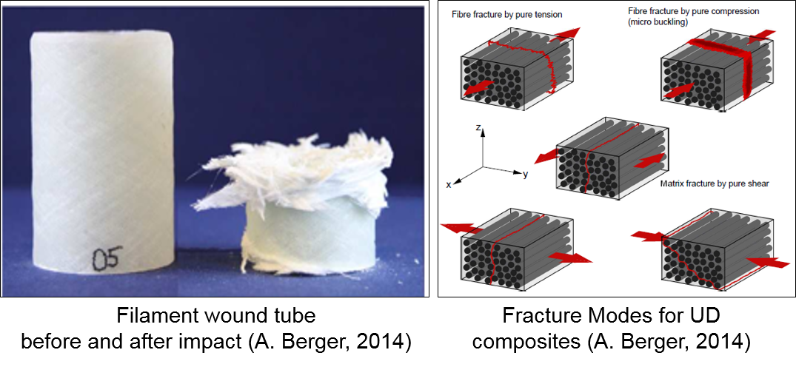
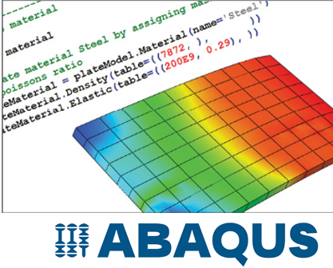

- [Development of the Failure Criteria for Composites](#development-of-the-failure-criteria-for-composites)
  - [Overview &amp; Motivation](#overview-amp-motivation)
  - [User Material Subroutines (UMAT/VUMAT)](#user-material-subroutines-umatvumat)
    - [1.UMAT Subroutine for implict FEM analysis](#1umat-subroutine-for-implict-fem-analysis)
    - [2.VUMAT Subroutine for explicit FEM analysis](#2vumat-subroutine-for-explicit-fem-analysis)
  - [Progressive Damage Analysis Framework](#progressive-damage-analysis-framework)
    - [1.Constitutive Law](#1constitutive-law)
    - [2.Failure Theories](#2failure-theories)
    - [3.Damage Models](#3damage-models)
  - [Testing and Results](#testing-and-results)
    - [1.Uni-Axial Plate Problem](#1uni-axial-plate-problem)
    - [2.Open-Hole Tensile Specimen](#2open-hole-tensile-specimen)
    - [3.Worldwide Failure Exercise](#3worldwide-failure-exercise)
  - [User Guide Manual](#user-guide-manual)
    - [UMAT Subroutines](#umat-subroutines)
    - [PDALAC Testing Program](#pdalac-testing-program)
  - [References](#references)
<li>The characteristic element length can be used to define softening behavior based on fracture energy concepts.</li>
</ul>](#ul-lithe-characteristic-element-length-can-be-used-to-define-softening-behavior-based-on-fracture-energy-conceptsli-ul)
    - [VUMAT Subroutine for explicit FEM analysis](#vumat-subroutine-for-explicit-fem-analysis)
  - [Progressive Damage Analysis Framework](#progressive-damage-analysis-framework)
    - [Constitutive Law](#constitutive-law)
    - [Failure Theories](#failure-theories)
    - [Damage Models](#damage-models)
  - [Testing and Results](#testing-and-results)
    - [Uni-Axial Plate Problem](#uni-axial-plate-problem)
    - [Open-Hole Tensile Specimen](#open-hole-tensile-specimen)
    - [Worldwide Failure Exercise](#worldwide-failure-exercise)
  - [User Guide Manual](#user-guide-manual)
    - [UMAT Subroutines](#umat-subroutines)
    - [PDALAC Testing Program](#pdalac-testing-program)


## Overview & Motivation
<p align="left">

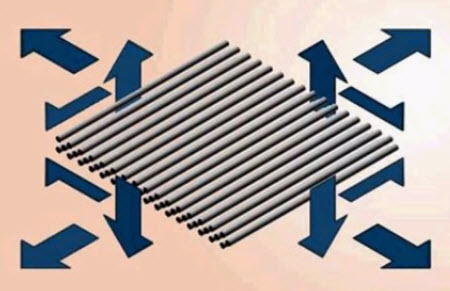
</p>

<p style="text-align: justify;">
Composite materials are a challenge to analyze. This challenge is characterized by complex
anisotropic behavior of the material and its heterogenous microstructure. This in turn leads to
complex failure and damage modes which are of primary concern for the safety and
performance of composite structures design. In context of computational mechanics, the
available material models in commercial nonlinear finite element analysis tools for modeling
these new material forms are often lagging behind the material science developments. In this
regard, this project aims to develop custom material subroutines for composite materials, the
developed models predict the onset of damage and damage progression in composite structures
according to wide range of failure theories and damage models that can be customized by users
accordingly to fit their requirements. The developed material models are verified using number
of benchmark problems from literature. Finally, realizing the challenges associated with
writing user defined material models, a standalone code “PDALAC” is developed to help
researchers to visualize the progressive damage analysis process without the need to conduct a
FEA, the developed code is written in vectorized form which can be easily translated to work
with multiple standard FEM packages (e.g. ABAQUS, ANSYS, LS-DYNA)</p>

<p align="center">

</p>

----------------------------------------------------------------------------------------------
## User Material Subroutines (UMAT/VUMAT)

<p style="text-align: justify;">
User subroutines are special features that are provided to increase the functionality of several Abaqus capabilities for which the usual data input methods alone may be too restrictive. The available subroutines offer a variety of options, from specifying user-defined loading or initial conditions, to the creation of user-defined elements. Thus, providing an extremely powerful and flexible tool for analysis. The subroutines are typically written as FORTRAN code and must be included in a model when executing the analysis. User subroutines should be written with great care. To ensure their successful implementation, the rules and guidelines below should be followed. For a detailed discussion of the individual subroutines, including coding interfaces and requirements, refer to the Abaqus User Subroutines Reference Manual</p> 

[_Abaqus User Subroutines Reference Manual_](http://dsk.ippt.pan.pl/docs/abaqus/v6.13/books/sub/default.htm)

----------------------------------------------------------------------------------------------
### 1.UMAT Subroutine for implict FEM analysis
UMAT is the user subroutine for the definition of user based constitutive models in ABAQUS/Standard solver.

According to the ABAQUS documentation the UMAT subroutine:
- Can be used to define the mechanical constitutive behavior of the material.
- Can be used with any procedure that includes mechanical behavior.
- Can use solution-dependent variables.
- Must update at each solution increment, the stresses and the solution dependent variables.
- Must provide the material Jacobian matrix (incremental stresses and strains relationship).

The UMAT subroutine header is shown below:

The include statement sets the proper precision for floating point variables (REAL*8 on most machines).

The material name, CMNAME, is an 8-byte character variable.

**UMAT Header**

```fortran
SUBROUTINE UMAT(STRESS,STATEV,DDSDDE,SSE,SPD,SCD,
     1 RPL,DDSDDT,DRPLDE,DRPLDT,
     2 STRAN,DSTRAN,TIME,DTIME,TEMP,DTEMP,PREDEF,DPRED,CMNAME,
     3 NDI,NSHR,NTENS,NSTATV,PROPS,NPROPS,COORDS,DROT,PNEWDT,
     4 CELENT,DFGRD0,DFGRD1,NOEL,NPT,LAYER,KSPT,KSTEP,KINC)
C
      INCLUDE 'ABA_PARAM.INC'
C
      CHARACTER*80 CMNAME
      DIMENSION STRESS(NTENS),STATEV(NSTATV),
     1 DDSDDE(NTENS,NTENS),DDSDDT(NTENS),DRPLDE(NTENS),
     2 STRAN(NTENS),DSTRAN(NTENS),TIME(2),PREDEF(1),DPRED(1),
     3 PROPS(NPROPS),COORDS(3),DROT(3,3),DFGRD0(3,3),DFGRD1(3,3)


      !user coding to define DDSDDE, STRESS, STATEV, SSE, SPD, SCD
      !and, if necessary, RPL, DDSDDT, DRPLDE, DRPLDT, PNEWDT


      RETURN
      END
```

**UMAT Variables**

1. The following quantities are available in UMAT:
- Stress, strain, and SDVs at the start of the increment
- Strain increment, rotation increment, and deformation gradient at the start and end of the increment
- Total and incremental values of time, temperature, and user-defined field variables
- Material constants, material point position, and a characteristic element length
- Element, integration point, and composite layer number (for shells and layered solids)
- Current step and increment numbers

2. The following quantities must be defined:
- Stress, SDVs, and material Jacobian
The following variables may be defined:
- Strain energy, plastic dissipation, and “creep” dissipation
- Suggested new (reduced) time increment

Complete descriptions of all parameters are provided in the UMAT section in Chapter 24 of the ABAQUS/Standard User’s
Manual.

**UMAT Utilities**

1. Utility routines SINV, SPRINC, SPRIND, and ROTSIG can be called to assist in coding UMAT.
- SINV will return the first and second invariants of a tensor.
- SPRINC will return the principal values of a tensor.
- SPRIND will return the principal values and directions of a tensor.
- ROTSIG will rotate a tensor with an orientation matrix.
- XIT will terminate an analysis and close all files associated with the analysis properly.

For details regarding the arguments required in making these calls, refer to the UMAT section in Chapter 24 of the
ABAQUS/Standard User’s Manual 


**UMAT Conventions**

1. Stresses and strains are stored as vectors.
- For plane stress elements: σ11 , σ22 , σ12 .
- For (generalized) plane strain and axisymmetric elements: σ11 , σ22 , σ33 , σ12 .
- For three-dimensional elements: σ11 , σ22 , σ33 , σ12 , σ13 , σ23 .
  
The shear strain is stored as engineering shear strain, γ 12 = 2ε12.

The deformation gradient, Fij , is always stored as a threedimensional matrix.

**Usage Hints**

1. At the start of a new increment, the strain increment is extrapolated from the previous increment.
- This extrapolation, which may sometimes cause trouble, is turned off with `∗STEP, EXTRAPOLATION=NO`
  
2. If the strain increment is too large, the variable PNEWDT can be used to suggest a reduced time increment.
- The code will abandon the current time increment in favor of a time increment given by PNEWDT*DTIME.
- The characteristic element length can be used to define softening behavior based on fracture energy concepts.
  
----------------------------------------------------------------------------------------------

### 2.VUMAT Subroutine for explicit FEM analysis
<p style="text-align: justify;">In ABAQUS/Explicit the user-defined material model is implemented in user subroutine VUMAT. In the VUMAT subroutine. The Stress and SDVs at the end of each solution increment must be defined. With comparison to the UMAT subroutine, the VUMAT subroutine has vectorized interface. In VUMAT the data are passed in and out in large blocks (dimension nblock), where each entry in an array of length nblock corresponds to a single material point. All material points in the same block have the same material name and belong to the same element type.</p>

The VUMAT subroutine header is shown below:

**VUMAT Header**

```fortran
      subroutine vumat(
C Read only (unmodifiable)variables -
     1  nblock, ndir, nshr, nstatev, nfieldv, nprops, lanneal,
     2  stepTime, totalTime, dt, cmname, coordMp, charLength,
     3  props, density, strainInc, relSpinInc,
     4  tempOld, stretchOld, defgradOld, fieldOld,
     5  stressOld, stateOld, enerInternOld, enerInelasOld,
     6  tempNew, stretchNew, defgradNew, fieldNew,
C Write only (modifiable) variables -
     7  stressNew, stateNew, enerInternNew, enerInelasNew )
C
      include 'vaba_param.inc'
C
      dimension props(nprops), density(nblock), coordMp(nblock,*),
     1  charLength(nblock), strainInc(nblock,ndir+nshr),
     2  relSpinInc(nblock,nshr), tempOld(nblock),
     3  stretchOld(nblock,ndir+nshr),
     4  defgradOld(nblock,ndir+nshr+nshr),
     5  fieldOld(nblock,nfieldv), stressOld(nblock,ndir+nshr),
     6  stateOld(nblock,nstatev), enerInternOld(nblock),
     7  enerInelasOld(nblock), tempNew(nblock),
     8  stretchNew(nblock,ndir+nshr),
     8  defgradNew(nblock,ndir+nshr+nshr),
     9  fieldNew(nblock,nfieldv),
     1  stressNew(nblock,ndir+nshr), stateNew(nblock,nstatev),
     2  enerInternNew(nblock), enerInelasNew(nblock),
C
      character*80 cmname
C

      do 100 km = 1,nblock
        !user coding
  100 continue

      return
      end
```

**VUMAT Variables**

1. The following quantities are available in VUMAT, but they cannot be redefined:

- Stress, stretch, and SDVs at the start of the increment
- Relative rotation vector and deformation gradient at the start and end of an increment and strain increment
- Total and incremental values of time, temperature, and user-defined field variables at the start and end of an increment
- Material constants, density, material point position, and a characteristic element length
- Internal and dissipated energies at the beginning of the increment
- Number of material points to be processed in a call to the routine (NBLOCK)

2. The following quantities must be defined:

- Stress and SDVs at the end of an increment
  
3. The following variables may be defined:
   
- Internal and dissipated energies at the end of the increment
  
Complete descriptions of all parameters are provided in the VUMAT section in Chapter 21 of the ABAQUS/Explicit User’s Manual.

**VUMAT Conventions**

1. Stresses and strains are stored as vectors.
- For plane stress elements: σ11 , σ22 , σ12 .
- For plane strain and axisymmetric elements: σ11 , σ22 , σ33 , σ12 .
- For three-dimensional elements: σ11 , σ22 , σ33 , σ12 , σ23 ,σ13 .
- For three-dimensional elements, this storage scheme is inconsistent with that for ABAQUS/Standard.
- The shear strain is stored as tensor shear strains: ε12 =1/2(γ12) 

2. The deformation gradient is stored similar to the way in which symmetric tensors are stored.
- For plane stress elements: F11, F22, F12, F21.
- For plane strain and axisymmetric elements: F11, F22, F33, F12, F21.
- For three-dimensional elements: F11, F22, F33, F12, F23, F31, F21, F32 , F13.


**VUMAT Formulation Aspects**

1. In VUMAT the data are passed in and out in large blocks (dimension NBLOCK). NBLOCK typically is equal to 64 or 128.
- Each entry in an array of length NBLOCK corresponds to a single material point. All material points in the same block
have the same material name and belong to the same element type.

2. This structure allows vectorization of the routine.
- A vectorized VUMAT should make sure that all operations are done in vector mode with NBLOCK the vector length.

3. In vectorized code, branching inside loops should be avoided.
- Element type-based branching should be outside the NBLOCK loop.

----------------------------------------------------------------------------------------------

## Progressive Damage Analysis Framework

<p align="left">

</p>

----------------------------------------------------------------------------------------------
### 1.Constitutive Law

**Material Modelling Scales**

- Can be studied on three different length scales. 
- Focus on macro-scale level in this project.
- Laminate properties on macroscale can be obtained from standard test data or through homogenization methods

<p align="left">
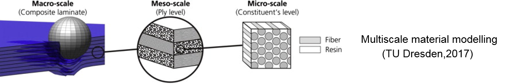
</p>

<p align="left">
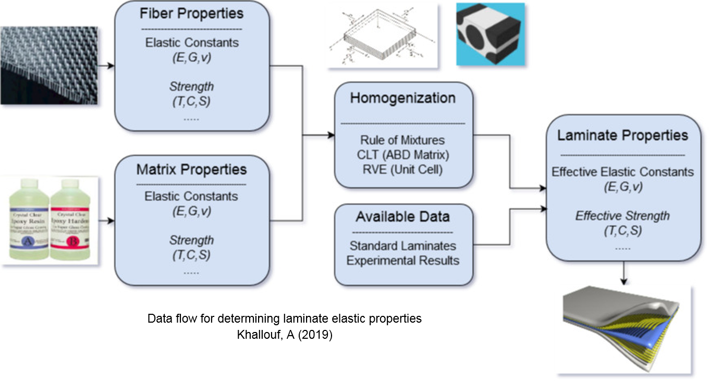
</p>


**Orthotropic Elasticity**

- General Hooke's Law for orthotropic elasticity

- Explicit consideration for 3D stress states

<p align="left">
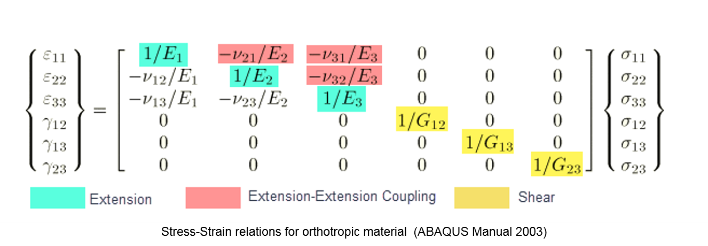
</p>

- Constitutive matrix to satisfy stability requirements

<p align="left">
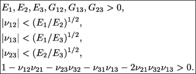
</p>

----------------------------------------------------------------------------------------------
### 2.Failure Theories
<p align="left">
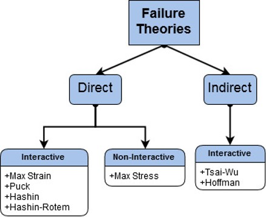
</p>

----------------------------------------------------------------------------------------------
### 3.Damage Models
<p align="left">
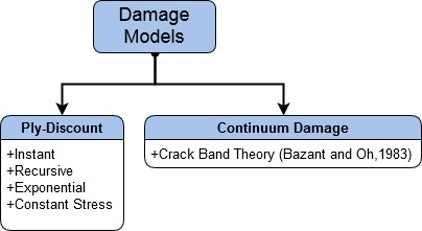
</p>

----------------------------------------------------------------------------------------------

## Testing and Results

### 1.Uni-Axial Plate Problem
Reference: **_Knight Jr, N. F., & Reeder, J. R. (2006). User-defined material model for progressive failure analysis_**

**Input Parameters**

<p align="left">

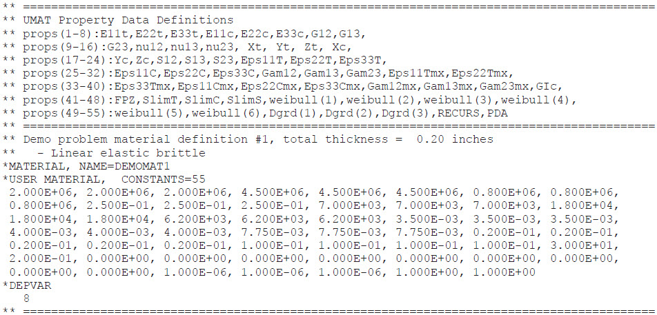
</p>

**Benchmark Results**

<p align="left">
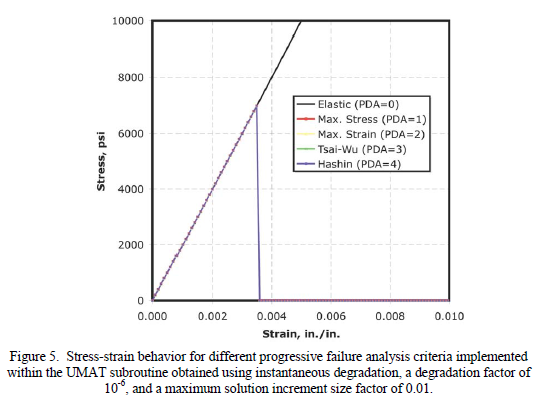

</p>


**UMAT Results**
<p align="left">
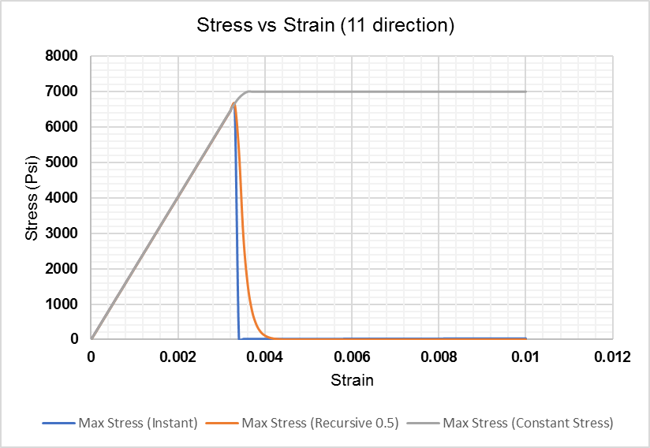
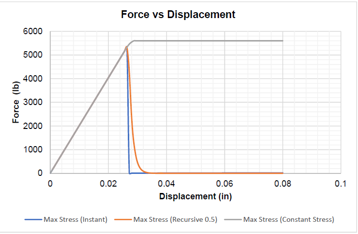
</p>


----------------------------------------------------------------------------------------------
### 2.Open-Hole Tensile Specimen
Reference:

----------------------------------------------------------------------------------------------
### 3.Worldwide Failure Exercise
Reference: **_Hinton, M. J. K. A., Kaddour, A. S., & Soden, P. D. (Eds.). (2004)_**

- Verification of Puck Criteria Implementation for Inter Fiber Failure

- Predict the fracture plane oreientation for Carbon Epoxy composite

**Input Parameters**

<p align="left">
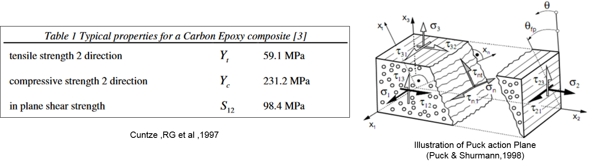
</p>

**Benchmark Results**
<p align="left">
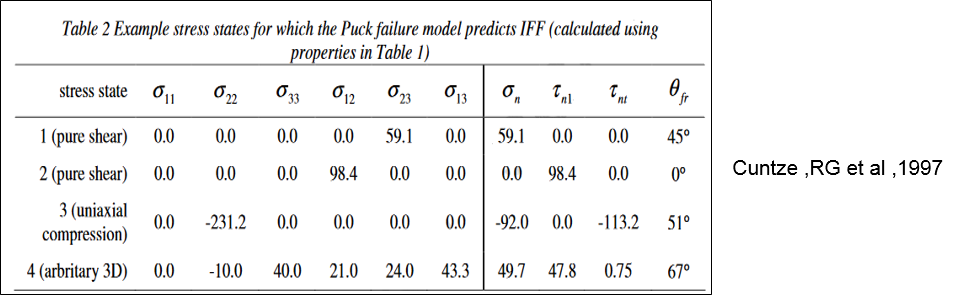
</p>


**UMAT Results**
<p align="left">
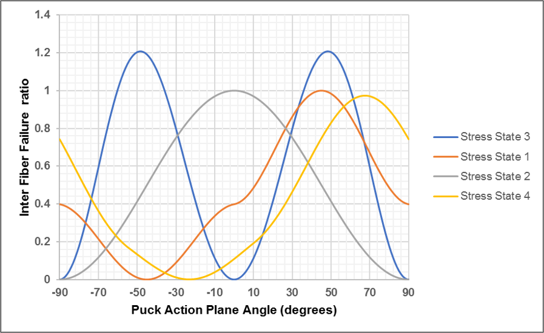
</p>

----------------------------------------------------------------------------------------------

## User Guide Manual

### UMAT Subroutines 

**User-defined property data for the UMAT subroutine**

|**PROPS Array Entry**|**Variable Name**|**Description**|
|---|---|---|
| 1,3|E11,E22,E33|Laminate Orthotropic Young's Moduli values (E11 fiber direction)|
| 4,6|ANU12,ANU13,ANU23|Poisson ratios v12,v13,v23|
| 7,9|G12,G13,G23|Laminate Shear Moduli values|
| 10,11|Xt,Xc|Laminate fiber allowable strengths (Tension/Compression)|
| 12,13|Yt,Yc|Laminate matrix allowable strengths (Tension/Compression)|
| 14,15|Zt,Zc|(Laminate interlaminar allowable strengths (Tension/Compression)|
| 16,17,18|S12,S13,S23|(Laminate allowable shear strengths (1-2,1-3,2-3 planes)|
| 19,20|EpsXt, EpsXc|Laminate fiber allowable strains (Tension/Compression)|
| 21,22|EpsYt, EpsYc|Laminate matrix allowable strains (Tension/Compression)|
| 23,34|EpsZt, EpsZc|(Laminate Interlaminar allowable strains (Tension/Compression)|
|25,26,27|GamS12,Gams13,GamS23|Laminate allowable engineering shear strains (1-2,1-3,2-3 planes)|
|28|failure_id|Failure criteria selection ID: (1) Max Stress (2)Max Strain (3)Tsai-Wu (4)Hoffman (5)Hashin (6)Hashin-Rotem (7)Puck|
|29|damage_id|Damage Model selection ID: (1) Instant (2)Recursive (3)Exponential (4)Constant Stress (5)(CDM)Crack-Band Theory|
|30,31|beta_ft, beta_fc|Instant/Recursive: fiber degradation factors (Tension/Compression)|
|32,33|beta_mt, beta_mc|Instant/Recursive: matrix degradation factors (Tension/Compression)|
|34|beta_s|Instant/Recursive: shear degradation factor (Tension/Compression)|
|35,36|a_ft, n_ft|Exponential: fiber degradation factors (Tension)|
|37,38|a_fc, n_fc|Exponential: fiber degradation factors (Compression)|
|39,40|a_mt, n_mt|Exponential: matrix degradation factors (Tension)|
|41,42|a_mc, n_mc|Exponential: matrix degradation factors (Compression)|
|43,44|a_s, n_s|Exponential: shear degradation factors|
|45,46|G_ft, G_fc|CDM: fiber fracture energies (Tension/Compression)|
|47,48|G_mt, G_mc|CDM: matrix fracture energies (Tension/Compression)|
|49,50|G_IC,G_IIC|CDM: shear fracture energies (Tension/Compression)|
|51,52|le,let|CDM: characteristic element length and thickness|
|53,54|alpha, beta|CDM: nonlinear shear degradation factors|
|55|THETAF|Puck: Maximum fracture angle in radians|
|56|MGF|Puck: Magnification factor|
|57,58|E11F, ANU12F|Puck: Fiber elastic modulus and Poisson ratio|


**UMAT-defined solution-dependent variables**

|**STATEV Array Entry**|**Variable Name**|**Description**|
|---|---|---|
|1| dmg(1)|Degradation factor for the σ11 stress component|
|2| dmg(2)|Degradation factor for the σ22 stress component|
|3| dmg(3)|Degradation factor for the σ33 stress component|
|4| dmg(4)| Degradation factor for the σ12 stress component|
|5| dmg(5)| Degradation factor for the σ13 stress component|
|6| dmg(6)| Degradation factor for the σ23 stress component|
|7|fflags(1)| Failure flag for first failure mode|
|8| fflags(2)| Failure flag for second failure mode|
|9| fflags(3)| Failure flag for third failure mode|
|10| fflags(4)| Failure flag for fourth failure mode|
|11| fflags(5)| Failure flag for fifth failure mode|
|12| fflags(6)| Failure flag for sixth failure mode|
|13| DelEl| Element deletion variable|

----------------------------------------------------------------------------------------------
### PDALAC Testing Program 

<p align="left">
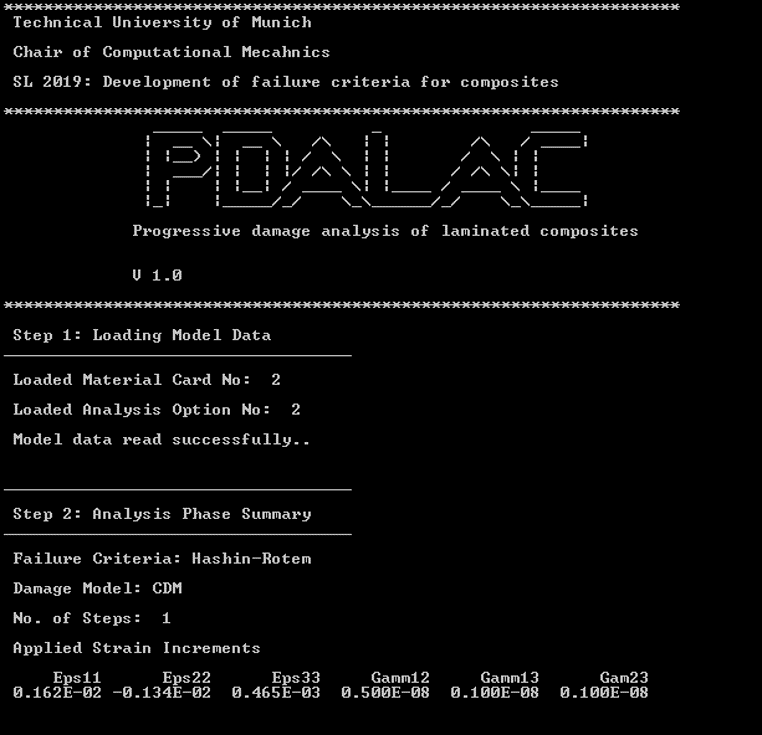

</p>


----------------------------------------------------------------------------------------------


## References